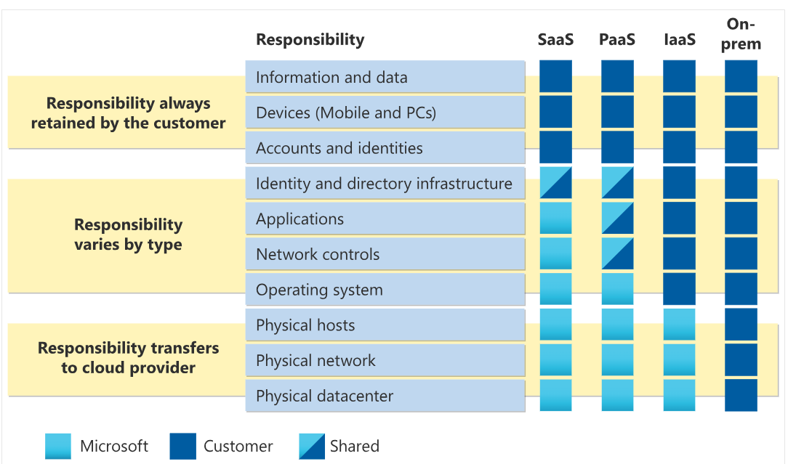
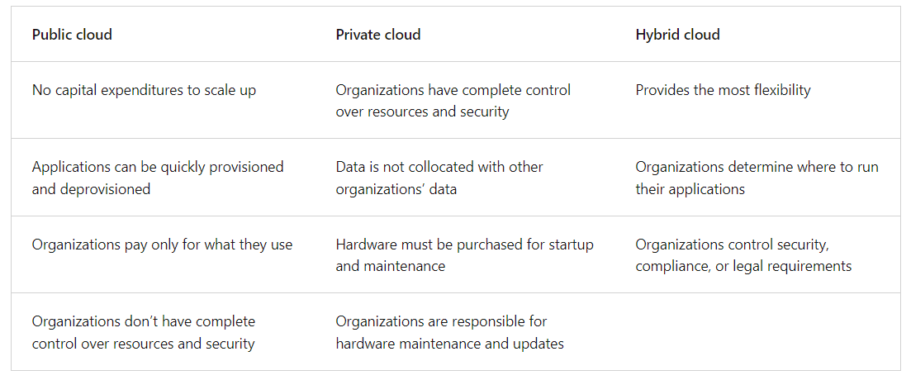

# Azure fundamentals

## Share responsibility model

With the shared responsibility model, these responsibilities get shared between the cloud provider and the consumer. Physical security, power, cooling, and network connectivity are the responsibility of the cloud provider. The consumer isn’t collocated with the datacenter, so it wouldn’t make sense for the consumer to have any of those responsibilities.

When using a cloud provider, you’ll always be responsible for:
- The information and data stored in the cloud
- Devices that are allowed to connect to your cloud (cell phones, computers, and so on)
- The accounts and identities of the people, services, and devices within your organization

The cloud provider is always responsible for:
- The physical datacenter
- The physical network
- The physical hosts

Your service model will determine responsibility for things like:
- Operating systems
- Network controls
- Applications
- Identity and infrastructure

## Cloud models

1. Private
2. Public
3. Hybrid

## Consumption based model 

Cloud computing falls under OpEx because cloud computing operates on a consumption-based model. With cloud computing, you don’t pay for the physical infrastructure, the electricity, the security, or anything else associated with maintaining a datacenter. Instead, you pay for the IT resources you use. If you don’t use any IT resources this month, you don’t pay for any IT resources.

- Benefits
    - No upfront costs.
    - No need to purchase and manage costly infrastructure that users might not use to its fullest potential.
    - The ability to pay for more resources when they're needed.
    - The ability to stop paying for resources that are no longer needed.